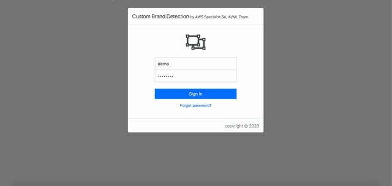
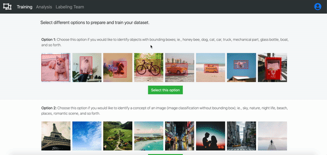
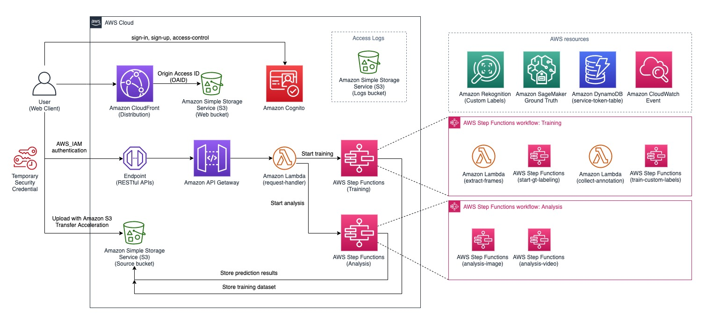
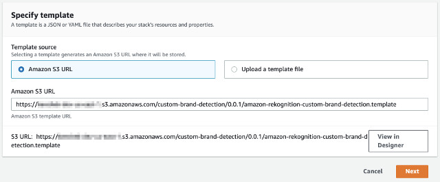
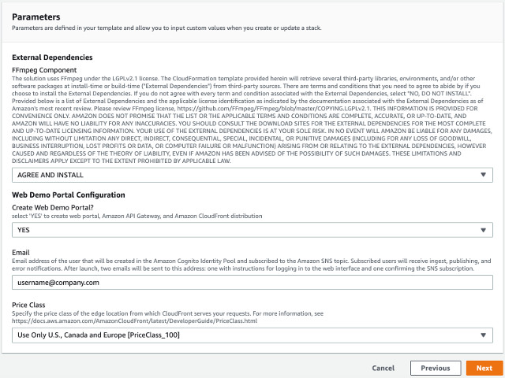
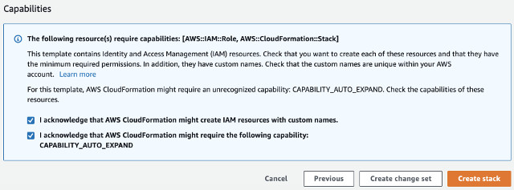
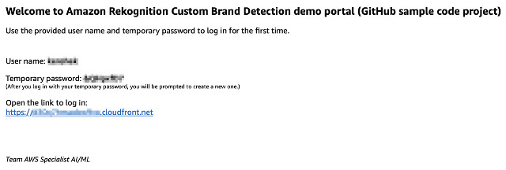

# Amazon Rekognition Custom Brand Detection

This solution demonstrates an end to end workflow from preparing training dataset and training a model to identifying and detecting specific brand on videos and images. It consists of two main workflows: Training and Analysis where the Training workflow takes images (JPEG or PNG) or video files (MP4 or MOV), creates a labeling job for your labelers using Amazon SageMaker Ground Truth service. When the labelers complete the labeling job, the solution uses the annotations from the labelers to prepare and train a custom label model using Amazon Rekognition Custom Labels service and deploys the model once the training completes. When the model is trained and ready to use, the Analysis workflow allows you to upload images and videos to run prediction. The web user interface provides visual statistics of how the detected brand (object) distributes across the analyzed images and videos.

The animated GIFs illustrate how this demo solution works.

## Configuring labeling team on Amazon SageMaker Ground Truth 

The first time you login, you will be prompted to configure a labeling team.



## Creating a new training project

To start a new training project, specify a program name, add labels, and upload video files.



## Amazon SageMaker Ground Truth labeling task

The labelers start to work on the labeling job created by the training workflow.


## Running prediction with trained model

Once a model is trained, we can run inference from Amazon Rekognition Custom Labels to detect labels.


___

# Architecture overview

The solution is designed with [serverless architecture](https://aws.amazon.com/serverless/). The architectural diagram below illustrates an overview of the solution.



User first signs in to the web portal using Amazon Cognito service. The web application is hosted on an Amazon Simple Storage Service (S3), a **web bucket** indicated in the diagram. The web bucket is protected by Amazon CloudFront distribution with [Origin Access Identity (OAID)](https://docs.aws.amazon.com/AmazonCloudFront/latest/DeveloperGuide/private-content-restricting-access-to-s3.html) which restricts direct access to the bucket.

Upon sign-in, the user is authenticated and is given a temporary security credential to access limited AWS resources such as permission to call a specific Amazon API Gateway endpoint and permission to upload video(s) to a specific Amazon Simple Storage Service (S3) bucket, the **source bucket**. The source S3 bucket is configured to take advantage of [Amazon S3 Transfer Acceleration](https://docs.aws.amazon.com/AmazonS3/latest/dev/transfer-acceleration.html).

Both the Traininng and Analysis workfkows can only be accessed through Amazon API Gateway endpoint where the incoming requests are authenticated with AWS_IAM, the temporary security credential. The API endpoint invokes a lambda function to handle the incoming requests.

An Amazon S3 logs bucket is created to store access logs from Amazon S3 buckets and Amazon CloudFront distribution.

Learn more about the implementation of:
* [RESTful API Component](./source/api/README.md)
* [Training Workflow](./source/gt-labeling/README.md)
  * [Custom Labels Model Training](./source/custom-labels/README.md#custom-labels-model-training-state-machine)
* [Analysis Workflow](./source/analysis/README.md)
  * [Image Analysis](./source/analysis-image/README.md)
  * [Video Analysis](./source/analysis-video/README.md)
  * [Custom Labels Start Model](./source/custom-labels/README.md#custom-labels-start-model-state-machine)
* [Webapp Component](./source/webapp/README.md)
* [Custom Resources Component used by AWS CloudFormation stack](./source/custom-resources/README.md)

___

# DISCLAMIER

This solution uses FFmpeg open source code under the [GNU Lesser General Public License (LGPL) version 2.1](https://github.com/FFmpeg/FFmpeg/blob/master/COPYING.LGPLv2.1). The CloudFormation template provided herein will retrieve several third-party libraries, environments, and/or other software packages at install-time or build-time ("External Dependencies") from third-party sources. There are terms and conditions that you need to agree to abide by if you choose to install the External Dependencies. If you do not agree with every term and condition associated with the External Dependencies, **DO NOT INSTALL** the solution.

Provided below is a list of External Dependencies and the applicable license identification as indicated by the documentation associated with the External Dependencies as of Amazon's most recent review.
Please review [FFmpeg license](https://github.com/FFmpeg/FFmpeg/blob/master/COPYING.LGPLv2.1).

THIS INFORMATION IS PROVIDED FOR CONVENIENCE ONLY. AMAZON DOES NOT PROMISE THAT THE LIST OR THE APPLICABLE TERMS AND CONDITIONS ARE COMPLETE, ACCURATE, OR UP-TO-DATE, AND AMAZON WILL HAVE NO LIABILITY FOR ANY INACCURACIES. YOU SHOULD CONSULT THE DOWNLOAD SITES FOR THE EXTERNAL DEPENDENCIES FOR THE MOST COMPLETE AND UP-TO-DATE LICENSING INFORMATION.   YOUR USE OF THE EXTERNAL DEPENDENCIES IS AT YOUR SOLE RISK. IN NO EVENT WILL AMAZON BE LIABLE FOR ANY DAMAGES, INCLUDING WITHOUT LIMITATION ANY DIRECT, INDIRECT, CONSEQUENTIAL, SPECIAL, INCIDENTAL, OR PUNITIVE DAMAGES (INCLUDING FOR ANY LOSS OF GOODWILL, BUSINESS INTERRUPTION, LOST PROFITS OR DATA, OR COMPUTER FAILURE OR MALFUNCTION) ARISING FROM OR RELATING TO THE EXTERNAL DEPENDENCIES, HOWEVER CAUSED AND REGARDLESS OF THE THEORY OF LIABILITY, EVEN IF AMAZON HAS BEEN ADVISED OF THE POSSIBILITY OF SUCH DAMAGES. THESE LIMITATIONS AND DISCLAIMERS APPLY EXCEPT TO THE EXTENT PROHIBITED BY APPLICABLE LAW.

The FFmpeg is built with [v4.3.1 source code](https://github.com/FFmpeg/FFmpeg/releases/tag/n4.3.1) and is compiled with the following flags:

```shell
export PATH="$HOME/bin:$PATH"
PKG_CONFIG_PATH="$PREFIX/lib/pkgconfig" ./configure \
  --prefix="$PREFIX" \
  --extra-cflags="-I$PREFIX/include -O2 -fstack-protector-strong -fpie -pie -Wl,-z,relro,-z,now -D_FORTIFY_SOURCE=2" \
  --extra-ldflags="-L$LIBRARY" \
  --extra-libs=-lpthread \
  --extra-libs=-lm \
  --bindir="$BINARY" \
  --enable-libfreetype \
  --enable-openssl \
  --enable-shared \
  --enable-pic \
  --disable-static \
  --disable-gpl \
  --disable-nonfree \
  --disable-version3 \
  --disable-debug \
  --disable-ffplay \
  --disable-libxcb \
  --disable-libxcb-shm \
  --disable-libxcb-xfixes \
  --disable-libxcb-shape \
  --disable-lzma \
  --disable-doc
make && make install

```

A build script to reproduce the FFmpeg binaries is provided [here](./source/layers/ffmpeg/build-ffmpeg-lgpl.sh)

___

# Launching solution with Pre-built AWS CloudFormation Template

**Version: 1.2.0**

The solution is deployed using an AWS CloudFormation template with AWS Lambda backed custom resources. To deploy the solution, use one of the following CloudFormation templates and follows the instructions.

| AWS Region | AWS CloudFormation Template URL |
|:-----------|:----------------------------|
| EU (Ireland) |<a href="https://console.aws.amazon.com/cloudformation/home?region=eu-west-1#/stacks/new?stackName=custom-brand-detection&templateURL=https://ml-specialist-sa-demo-eu-west-1.s3-eu-west-1.amazonaws.com/custom-brand-detection/1.2.0/amazon-rekognition-custom-brand-detection.template" target="_blank">Launch stack</a> |
| US East (N. Virginia) |<a href="https://console.aws.amazon.com/cloudformation/home?region=us-east-1#/stacks/new?stackName=custom-brand-detection&templateURL=https://ml-specialist-sa-demo-us-east-1.s3.amazonaws.com/custom-brand-detection/1.2.0/amazon-rekognition-custom-brand-detection.template" target="_blank">Launch stack</a> |
| US East (Ohio) |<a href="https://console.aws.amazon.com/cloudformation/home?region=us-east-2#/stacks/new?stackName=custom-brand-detection&templateURL=https://ml-specialist-sa-demo-us-east-2.s3.us-east-2.amazonaws.com/custom-brand-detection/1.2.0/amazon-rekognition-custom-brand-detection.template" target="_blank">Launch stack</a> |
| US West (Oregon) |<a href="https://console.aws.amazon.com/cloudformation/home?region=us-west-2#/stacks/new?stackName=custom-brand-detection&templateURL=https://ml-specialist-sa-demo-us-west-2.s3-us-west-2.amazonaws.com/custom-brand-detection/1.2.0/amazon-rekognition-custom-brand-detection.template" target="_blank">Launch stack</a> |


* Under **Create stack** page, click **Next** to continue



* In **Specify stack details** page, select AGREE AND INSTALL under **FFmpeg Component**, select YES under **Create Web Demo Portal?**, and provide your **Email** and select Amazon CloudFront **Price Class** parameters. Click **Next** to continue



* In **Review stack** page, scroll to the bottom. Under **Capabilities**, make sure both checkboxes are checked. Then, click on **Create stack**



The stack creation takes roughly 15 minutes to complete the stack as Amazon CloudFront distribution takes about 15 minutes to propagate to the edge locations.

__

After the stack is created (~15 minutes), you should receive an invitation email from no-reply@verificationmail.com. The email contains an Amazon CloudFront URL link to access the demo portal, your login username, and a temporary password.



___

# Building and customizing the solution

## Build Environment
The sample code is written in NodeJS v10.x. Before you start, please make sure NodeJS has been installed. You would also need to create an Amazon Simple Storage Service (Amazon S3) bucket to store the build artifacts. 


### NodeJS
Make sure you install NodeJS 10.x or above onto your system.

For MAC user, download and install from [nodejs.org](https://nodejs.org/en/download/). Alternatively, you can also use Homebrew.

For Linux or Amazon EC2 user, follow [Tutorial: Setting Up Node.js on an Amazon EC2 Instance](https://docs.aws.amazon.com/sdk-for-javascript/v2/developer-guide/setting-up-node-on-ec2-instance.html)

For Windows 10 user, make sure to install [Windows Subsystem for Linux](https://docs.microsoft.com/en-us/windows/wsl/install-win10) before installing NodeJS. The build and deploy scripts are written in Bash script.


### AWS CLI

The **deploy-s3-dist.sh** shell script uploads the build artifacts to your S3 bucket; thus, it requires [AWS CLI](https://docs.aws.amazon.com/cli/latest/userguide/cli-chap-install.html) to be installed and configured.

```shell
# after AWS CLI is installed, run the command and follow the instruction to configure your profile

aws configure

```

### Amazon S3 Bucket

Create a S3 bucket to store the build artifacts: AWS CloudFormation (CFN) templates and Amazon Lambda packages.

Note: make sure to choose the region you intend to run the workflow; for example, us-east-1 region.


__

## To build the sample code,
* Clone the repository

```shell
git clone git@github.com:awslabs/amazon-rekognition-custom-brand-detection.git

```

* Change directory to **deployment** and run **build-s3-dist.sh**

```shell
cd amazon-rekognition-custom-brand-detection/deployment
bash build-s3-dist.sh --bucket your-bucket

```

* Deploy the package to your S3 bucket

```shell
bash deploy-s3-dist.sh --bucket your-bucket

# optionally you could specify different AWS CLI Profile,
# AWS CLI profile (default to 'default')
# and ACL settings (default to bucket-owner-full-control)
bash deploy-s3-dist.sh --bucket your-bucket \
--profile DevProfile \
--acl public-read

```

Now you should have all the code packages and CFN templates uploaded to your S3 bucket.

Log in to [AWS S3 Console](https://s3.console.aws.amazon.com/s3/home) and navigate to the bucket you created.

Make sure you see the following files under **/custom-brand-detection/1.2.0/**

| Name | Description |
|:---  |:------------|
| ========================= | **CloudFormation resources** ========================= |
| amazon-rekognition-custom-brand-detection.template | main cloudformation template to create the solution |
| cfn-webapp-stack.template | nested stack to create web components |
| cfn-codebuild-ffmpeg-stack.template | nested stack to build and deploy FFmpeg on your AWS account using Amazon CodeBuild |
| custom-resources-0.0.1.zip | lambda package of custom resources used by AWS CloudFormation during stack creation, update, and deletion |
| ========================= | **CodeBuild resources** ========================= |
| codebuild-custom-resources-0.0.1.zip | lambda package of custom resources to start a CodeBuild project |
| codebuild-ffmpeg-0.0.1.zip | ffmpeg build script package for CodeBuild to build FFmpeg component |
| ========================= | **Lambda Layers** ========================= |
| aws-sdk-layer-0.0.1.zip | lambda layer package of the latest AWS SDK |
| canvas-0.0.1.zip | lambda layer package of Node Canvas compomnent |
| core-lib-0.0.1.zip | lambda layer package of the core library shared among other lambda functions |
| ========================= | **Workflow Lambda resources** ========================= |
| analysis-0.0.1.zip | lambda package of analysis step functions state machine |
| analysis-image-0.0.1.zip | lambda package of image analysis step functions state machine |
| analysis-video-0.0.1.zip | lambda package of video analysis step functions state machine |
| gt-labeling-0.0.1.zip | lambda package of training and labeling step functions state machine |
| custom-labels-0.0.1.zip | lambda package of training and starting custom labels model |
| model-timer-stream-0.0.1.zip | lambda package of handling auto spin down Amazon Rekognition Custom Labels model (model management) |
| status-updater-0.0.1.zip | a package of lambda function to receive events from Amazon CloudWatch Event and Amazon Simple Notification Service (SNS) and to send task result signaling the AWS Step Functions state machine execution when a task is completed or failed. |
| ========================= | **WebApp and API Gateway resources** ========================= |
| api-0.0.1.zip | lambda package to handle GET, POST, DELETE, and OPTIONS requests from Amazon API Gateway endpoint |
| custom-brand-detection-webapp-0.0.1.zip | web component package |

___

# Launching your customized solution

This section covers two different methods to deploy your customized solution: 1) using AWS CloudFormation Console and 2) using AWS CLI command.

### Method 1: Using AWS CloudFormation Console
* Log on to [AWS CloudFormation Console](https://console.aws.amazon.com/cloudformation/home)
* Click on **Create stack** with new resources (standard)
* Follow the [instruction](#launch-solution-with-aws-cloudformation-stack) described earlier. **Make sure to specify the S3 location of your customized CloudFormation template under the _Amazon S3 URL_ field**.

### Method 2: Using AWS CLI Command
* Create a JSON input file as follows and save it locally; ie., cfn-input.json

```json
[
  {
    "ParameterKey": "AgreeFFmpegUse",
    "ParameterValue": "AGREE AND INSTALL"
  },
  {
    "ParameterKey": "CreateWebPortal",
    "ParameterValue": "YES"
  },
  {
    "ParameterKey": "Email",
    "ParameterValue": "yourname@email.com"
  },
  {
    "ParameterKey": "PriceClass",
    "ParameterValue": "Use Only U.S., Canada and Europe [PriceClass_100]"
  }
]

```
* Run the following AWS CLI command to create the stack

```shell
aws cloudformation create-stack \
--stack-name custom-brand-detection \
--template-url https://your-bucket.s3.amazonaws.com/custom-brand-detection/1.2.0/amazon-rekognition-custom-brand-detection.template  \
--parameters file://cfn-input.json \
--capabilities "CAPABILITY_IAM"

```

___

# Deleting the demo solution
To delete the demo solution, simply delete the CloudFormation stack that was deployed earlier.

**Important note:** deleteing the CloudFormation stack does _NOT_ remove the following resources. Therefore, make sure you manually clean up these resources to avoid potential recurring cost.
* Amazon S3 bucket (web)
* Amazon S3 bucket (source)
* Amazon S3 bucket (logs)
* Amazon Rekognition Custom Labels models that you trained (no recurring cost if your model is not in running mode)

___

# Security

When you build systems on AWS infrastructure, security responsibilities are shared between you and AWS. This shared model can reduce your operational burden as AWS operates, manages, and controls the components from the host operating system and virtualization layer down to the physical security of the facilities in which the services operate. For more information about security on AWS, visit the [AWS Security Center](https://aws.amazon.com/security).

## Server-Side Encryption
AWS highly recommends that customers encrypt sensitive data in transit and at rest. This demo solution automatically encrypts image files and metadata at rest with [Amazon Simple Storage Service (Amazon S3) Server-Side Encryption (SSE)](https://docs.aws.amazon.com/AmazonS3/latest/dev/serv-side-encryption.html).


## Amazon CloudFront
This demo solution deploys a static website [hosted](https://docs.aws.amazon.com/AmazonS3/latest/dev/WebsiteHosting.html) in an Amazon S3 bucket. To help reduce latency and improve security, this solution includes an Amazon CloudFront distribution with an origin access identity, which is a special CloudFront user that helps restrict access to the solution’s website bucket contents. For more information, see [Restricting Access to Amazon S3 Content by Using an Origin Access Identity](https://docs.aws.amazon.com/AmazonCloudFront/latest/DeveloperGuide/private-content-restricting-access-to-s3.html).

___

# Cost Estimation

The solution uses various AWS services. Please make sure to check the pricing for each of the services.

* [Amazon Rekognition Custom Labels - training and inference hours](https://aws.amazon.com/rekognition/pricing/)
* [Amazon SageMaker Ground Truth - numbers of labeled objects](https://aws.amazon.com/sagemaker/groundtruth/pricing/)
* [AWS Step Functions - state transitions](https://aws.amazon.com/step-functions/pricing/)
* [Amazon Lambda - requests and durations](https://aws.amazon.com/lambda/pricing/)
* [Amazon S3](https://aws.amazon.com/s3/pricing/)
  * Intelligent - Tiering
  * Transfer acceleration
* [Amazon CloudFront - on-demand](https://aws.amazon.com/cloudfront/pricing/)
* [Amazon DynamoDB - on-demand](https://aws.amazon.com/dynamodb/pricing/on-demand/)
* [Amazon Simple Notification Service](https://aws.amazon.com/sns/pricing/)
* [Amazon Cognito](https://aws.amazon.com/cognito/pricing/)
* [Amazon API Gateway - REST API](https://aws.amazon.com/api-gateway/pricing/)
* [AWS CloudFormation](https://aws.amazon.com/cloudformation/pricing/)
* [Amazon CloudWatch Event](https://aws.amazon.com/cloudwatch/pricing/)

## Pricing example

The pricing example is broken down into two phases:

* cost of training a new model
* cost of running inference with a trained model

The example assumes that the solution is running in **US East (N. Virginia)** region.

### Training phase

Assume we use a video file with a file size of **100MB**. During the data preparation, we extract frames from the video. Let's assume that we extract **500 frames** from the video. The labeler starts to work on the labeling job and finishes with **200 labeled objects**. The Training workflow then creates and trains an Amazon Rekognition Custom Labels model. Let's also assume that it takes **1 hour and 30 minutes** to train the model.

Here is an estimated cost for the Training phase.

| Stage | Cost Type | Unit Cost | # of Requests | Cost Per Item |
|:------|:----------|:----------|:--------------|:--------------|
| Upload | Amazon S3 Transfer Acceleration | $0.04 per GB | 100MB | $0.004 |
| Upload | Amazon S3 Storage | $0.023 per GB / Month | 100MB | $0.0023 |
| Frame Extraction (State Machine) | Amazon Lambda Duration (3008MB Memory) | $0.0000048958 per 100ms | 100000ms | $0.0049 |
| Frame Extraction | Amazon S3 Storage | $0.023 per GB / Month | 500 frames * 200KB ~= 100MB | $0.0023 |
| Human Labeling | Amazon SageMaker Ground Truth | $0.08 per labeled object | 200 objects | $16 |
| Model Training | Amazon Rekognition Custom Labels Training | $1 per hour | 01h30m | $1.50 |
| State Machine | Amazon Step Functions State Transitions | $0.025 per 1K state transitions | 40 transitions | $0.001 |
| | | | **Total Cost** | **$17.51** |


### Analysis phase

Assume we are analyzing a 16-minute video with a file size of **200MB**. The Analysis workflow first extracts frames from the video. Let's assume that we extract **2,800 frames** (roughly 3 frames per sec) from the video. Thus, we are analyzing 2,800 frames through the model inference. Let's also assume that we use **5 inference units** to reduce the inference time.

Here is an estimated cost for the Analysis phase.

| Stage | Cost Type | Unit Cost | # of Requests | Cost Per Item |
|:------|:----------|:----------|:--------------|:--------------|
| Upload | Amazon S3 Transfer Acceleration | $0.04 per GB | 200MB | $0.008 |
| Upload | Amazon S3 Storage | $0.023 per GB / Month | 200MB | $0.0046 |
| Frame Extraction (State Machine) | Amazon Lambda Duration (3008MB Memory) | $0.0000048958 per 100ms | 120000ms | $0.0060 |
| Frame Extraction | Amazon S3 Storage | $0.023 per GB / Month | 2,800 frames * 200KB = 560MB | $0.013 |
| Runing inference | Amazon Rekognition Custom Labels Inference | $4 per hour per inference unit | 20mins | $6.67 |
| State Machine | Amazon Step Functions State Transitions | $0.025 per 1K state transitions | 40 transitions | $0.001 |
| | | | **Total Cost** | **$6.70** |

___

# Supported Regions

Amazon Rekognition Custom Labels is supported in the following regions:
* US East (N. Virginia) (us-east-1)
* US East (Ohio) (us-east-2)
* US West (N. California) (us-west-1)
* US West (Oregon) (us-west-2)
* Europe (Frankfurt) (eu-central-1)
* Europe (Ireland) (eu-west-1)
* Europe (London) (eu-west-2)
* Asia Pacific (Mumbai) (ap-south-1)
* Asia Pacific (Seoul) (ap-northeast-2)
* Asia Pacific (Singapore) (ap-southeast-1)
* Asia Pacific (Sydney) (ap-southeast-2)
* Asia Pacific (Tokyo) (ap-northeast-1)

Make sure to check [AWS Region Table](https://aws.amazon.com/about-aws/global-infrastructure/regional-product-services/) for any updated region support for the service.

___

# AWS Resources

## Bill of Materials
The solution creates and uses the following AWS resources:

* [Amazon S3](https://aws.amazon.com/s3/) (x3)
  * a web bucket to host the web application
  * a source bucket to store images for training data, images for analysis, and dataset manifests
  * a log bucket to store access logs from other AWS resources used in the demo solution
* [Amazon Rekognition Custom Labels](https://aws.amazon.com/rekognition/custom-labels-features/)
* [Amazon SageMaker Ground Truth Labeling Job and Private Workforce](https://aws.amazon.com/sagemaker/groundtruth/)
* [AWS Step Functions](https://aws.amazon.com/step-functions/pricing/) (x6)
  * Training and Labeling state machine managing the dataset preparing and training model
  * Custom Labels Model Training state machine monitoring model training process
  * Analysis state machine managing analysis request
  * Image Analysis state machine running image analysis
  * Video Analysis state machine running video analysis
  * Custom Labels Start Model state machine monitoring model runtime
* [Amazon Lambda](https://aws.amazon.com/lambda/) (x8)
  * AWS Step Functions State Machine
    * a 3008MB lambda function for Labeling and Training State Machine
    * a 128MB lambda function for Analysis State Machine
    * a 128MB lambda function for Image Analysis State Machine
    * a 3008MB lambda functions for Video Analysis State Machine
    * a 128MB lambda function for Custom Labels Model Training and Custom Labels Start Model State Machine
  * Amazon API Gateway
    * a 256MB lambda function for API Gateway backend to handle GET, POST, DELETE, and OPTIONS
  * Amazon DynamoDB
    * a 128MB lambda function for Model Timer Stream to handle Amazon DynamoDB Stream event
  * Amazon CloudWatch Event
    * a 128MB lambda function for Status Updater to handle Amazon SageMaker Ground Truth CloudWatch Event
* [Amazon Simple Notification Service](https://aws.amazon.com/sns/)
  * a SNS topic to send email notification to the workers when a labeling job is ready
* [Amazon Cognito](https://aws.amazon.com/cognito/) (x2)
  * an User Pool and Identity Pool for the web application handling sign-in, sign-up, and authentication
  * an User Pool for labeling workers handling sign-in, sign-up, and authentication to the labeling portal
* [Amazon API Gateway](https://aws.amazon.com/api-gateway/)
  * RESTful API endpoints to interact with web appplication
* [Amazon CloudFront](https://aws.amazon.com/cloudfront/)
  * a CloudFront distribution to host web application
* [Amazon DynamoDB](https://aws.amazon.com/dynamodb/pricing/) (x2)
  * a service token DynamoDB table to temporarily store Step Functions execution service token, used to communicate back to the state machine
  * a model timer DynamoDB table to manage model runtime and auto stop model when it is idle
* [Amazon Identity and Access Management](https://aws.amazon.com/iam/)
  * IAM Roles for the custom resource and the Lambda function
* [AWS CloudFormation](https://aws.amazon.com/cloudformation/)
* [AWS CodeBuild](https://aws.amazon.com/codebuild/)
  * to compile and build FFmpeg on stack creation


___

# License

[MIT-0](./LICENSE.txt)

___

Next to [RESTful API Component](./source/api/README.md)
