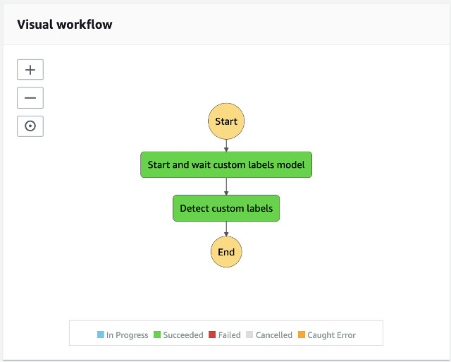

# Image Analysis State Machine

## Overview

The Image Analysis State Machine processes an image file. It first auto-starts the Amazon Rekognition Custom Labels model and then run detectCustomLabels APIs to analzye the image.


The diagram presents the image analysis state machine.



___

## State Machine Execution Input

Refer to the [Analysis State Machine Execution Input](../analysis/README.md#state-machine-execution-input).


__

## State: Start and wait custom labels model

This state starts the custom labels model and waits for the custom labels model becomes active by calling a nested state machine, **Custom Labels Start Model State Machine**.

See the implementation of the [Custom Labels Start Model State Machine](../custom-labels/README.md#custom-labels-start-model-state-machine)

__


## State: Detect custom labels

Detect custom labels state calls Rekonigtion.DetectCustomLabels APIs to analyze the image file and stores the JSON result to the Amazon S3 source bucket.

___

## Navigating the code structure

This state machine only implements one state lambda function and the code is under [source/analysis-image/states/](./states)

| Name | Description |
|:-----|:------------|
| detect-custom-labels/ | Detect custom labels state |

___

## Navigating State Machine Outputs on Amazon S3 Source Bucket

The state machine stores the Custom Labels Detection JSON result to the Amazon S3 **source** bucket.

| Location | Description |
|:---------|:------------|
| s3://\<source-bucket\>/\<image-basename\>/detect-custom-labels/\<image-basename\>.json | DetectCustomLabels JSON result |


___

## Security

The Image Analysis state machine is govening by two IAM Roles: one for the state machine and one for the state lambda function.


### IAM Role of the State Machine
The State Machine is given permission to **invoke** specific lambda functions and to start and stop a nested state machine, Custom Labels Training state machine.

```json
{
    "Version": "2012-10-17",
    "Statement": [
        {
            "Action": "lambda:InvokeFunction",
            "Resource": "arn:aws:lambda:<region>:<account>:function:ml9804-<stack-id>-*",
            "Effect": "Allow"
        },
        {
            "Action": "states:StartExecution",
            "Resource": "arn:aws:states:<region>:<account>:stateMachine:ml9804-<stack-id>-custom-labels-start-model",
            "Effect": "Allow"
        },
        {
            "Action": [
                "states:DescribeExecution",
                "states:StopExecution"
            ],
            "Resource": "arn:aws:states:<region>:<account>:stateMachine:ml9804-<stack-id>-custom-labels-start-model",
            "Effect": "Allow"
        },
        {
            "Action": [
                "events:PutTargets",
                "events:PutRule",
                "events:DescribeRule"
            ],
            "Resource": "arn:aws:events:<region>:<account>:rule/StepFunctionsGetEventsForStepFunctionsExecutionRule",
            "Effect": "Allow"
        }
    ]
}

```

__

### IAM Role of the State Lambda Functions

The state lambda function is given permission to access the **Amazon S3** source bucket, to run Amazon Rekognition DetectCustomLabels API, and to update item on an **Amazon DynamoDB** table, model-timer table.

```json
{
    "Version": "2012-10-17",
    "Statement": [
        {
            "Action": [
                "logs:CreateLogGroup",
                "logs:CreateLogStream",
                "logs:PutLogEvents"
            ],
            "Resource": "arn:aws:logs:<region>:<account>:log-group:/aws/lambda/*",
            "Effect": "Allow"
        },
        {
            "Action": "s3:ListBucket",
            "Resource": "arn:aws:s3:::<bucket-name>",
            "Effect": "Allow"
        },
        {
            "Action": [
                "s3:GetObject",
                "s3:PutObject"
            ],
            "Resource": "arn:aws:s3:::<bucket-name>/*",
            "Effect": "Allow"
        },
        {
            "Action": "rekognition:DetectCustomLabels",
            "Resource": "arn:aws:rekognition:<region>:<account>:project/*/version/*/*",
            "Effect": "Allow"
        },
        {
            "Action": [
                "dynamodb:DeleteItem",
                "dynamodb:DescribeTable",
                "dynamodb:Query",
                "dynamodb:Scan",
                "dynamodb:PutItem",
                "dynamodb:UpdateItem",
                "dynamodb:Attributes",
                "dynamodb:LeadingKeys",
                "dynamodb:ReturnConsumedCapacity",
                "dynamodb:ReturnValues",
                "dynamodb:Select"
            ],
            "Resource": "arn:aws:dynamodb:<region>:<account>:table/ml9804-<stack-id>-model-timer",
            "Effect": "Allow"
        }
    ]
}

```

___

Go to [Video Analysis State Machine](../analysis-video/README.md) | Back to [Analysis State Machine](../analysis/README.md) | Return to [README](../../README.md)

