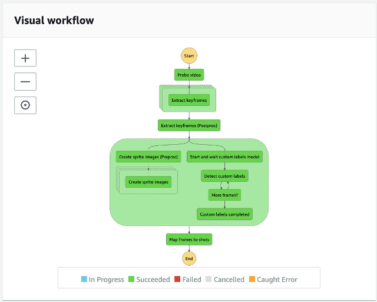

# Video Analysis State Machine

## Overview

The Video Analysis State Machine is composed of numbers of states: (1) **Probe video** to gather frame information of a given video file, (2) **Extract keyframes** to extract frames from the video, (3) **Start and wait custom labels model** to ensure the model is running, (4) **Detect custom labels** to run predictions, and (5) **Create sprite images** to create sprite image for the web user interface.

The diagram presents the video analysis state machine.



___

## State Machine Execution Input
Refer to the [Analysis State Machine Execution Input](../analysis/README.md#state-machine-execution-input).

__

## State: Probe video

Probe video state prepares a list of iterations for the next state, Extract keyframes state, to achieve parallel processing using [AWS Step Functions Map](https://docs.aws.amazon.com/step-functions/latest/dg/amazon-states-language-map-state.html) feature. It allows us to optimize for speed by parallelly extracting frames from the input video file.

__

## State: Extract keyframes

Extract keyframes state is a Map state where each iterator is given an input specifying the video file, the location of the frame information, numbers of frames to extract from the video, and the start location of the video to extract frames.

Here is an input example of each iterator of this Map state:

```json
{
  "bucket": "<bucket-name>",
  "key": "path/video01.mp4",
  "keyframesJson": "video01/extract-keyframes/keyframes.json",
  "startIndex": 1800,
  "framesPerSlice": 600
}

```
where 

| Parameter Name | Description |
| :--------------| :-----------|
| bucket | source bucket name |
| key | the specific video file to work on |
| keyframesJson | the frame information extracted from Probe video state |
| startIndex | frame index of this Map iterator should start the frame extraction |
| framesPerSlice | numbers of frames this Map iterator should extract |

__

## State: Extract keyframes (Postproc)

Extract keyframes (Postproc) state is a post processing step to consolidate the results from the previous Map state.

__

## State: Start and wait custom labels model

This state starts the custom labels model and waits for the custom labels model becomes active by calling a nested state machine, **Custom Labels Start Model State Machine**.

See the implementation of the [Custom Labels Start Model State Machine](../custom-labels/README.md#custom-labels-start-model-state-machine)

__

## State: Detect custom labels

Detect custom labels state calls Rekonigtion.DetectCustomLabels APIs to analyze extracted frames from the video file and stores the JSON result to the Amazon S3 source bucket.

__

## State: More frames?

A Choice state to move to either Detect custom labels state if there are more frames to process or Custom labels completed state when no more frame to process by checking the state status variable, **$.output['detect-custom-labels'].status**.

__

## State: Custom labels completed

An End state of this parallel branch.

__

## State: Create sprite images (Preproc)

The solution creates sprite images for every minute of the video file for the web user interface to display frames. Thus, the Create sprite images (Preproc) and Create sprite images states are used to slice and compile sprite images for the video.

Create sprite images (Preproc) state prepares a list of iterations for the next state, Create sprite images state, to achieve parallel processing using [AWS Step Functions Map](https://docs.aws.amazon.com/step-functions/latest/dg/amazon-states-language-map-state.html) feature.

__

## State: Create sprite images

Create sprite images state is a Map state where each iterator is given an input specifying the video file, the index of the sprite image, the starting index of the frames, and numbers of frames to use for this sprite image.

Here is an input example of each iterator of this Map state:

```json
{
  "bucket": "<bucket-name>",
  "key": "path/video01.mp4",
  "index": 0,
  "startIndex": 0,
  "framesPerSlice": 121
}

```
where 

| Parameter Name | Description |
| :--------------| :-----------|
| bucket | source bucket name |
| key | the specific video file to work on |
| index | the current sprite image index |
| startIndex | frame index of this Map iterator should start creating the sprite image |
| framesPerSlice | numbers of frames this Map iterator should use to create a sprite |

__


## State: Map frames to shot

Map frames to shot state combines and consolidates the custom labels detection result and sprite images into a consolidated JSON file that contains pointers to locate frame images, detection results, and the corresponding sprite image.

___

## Navigating the code structure

The code is structured by its state names under [source/analysis-video/states/](./states)

| Name | Description |
|:-----|:------------|
| probe-video/ | Probe video Map state |
| extract-keyframes/ | Extract keyframes Map state |
| extract-keyframes-post-proc/ | Extract keyframes (Postproc) state |
| detect-custom-labels/ | Detect custom labels state |
| create-sprite-images-preproc/ | Create sprite images (Preproc) state |
| create-sprite-images | Create sprite images Map state |
| map-frames-shots | Map frames to shot state |
| shared/ | shared components for this state machine |


The state machine lambda function also uses numbers of AWS Lambda Layers, (1) core-lib which contains common utility classes shared across other components of the solution, (2) FFmpeg layer which helps to probe video and extract frames, (3) Jimp layer to resize and create sprite images, and (4) Latest AWS SDK layer.

___

## Navigating State Machine Outputs on Amazon S3 Source Bucket

The state machine stores various state outputs to the Amazon S3 **source** bucket organized by its state names.

| Location | Description |
|:---------|:------------|
| s3://\<source-bucket\>/\<video-basename\>/extract-keyframes/keyframes.json | keyframes.json contains the frame information of the video file |
| s3://\<source-bucket\>/\<video-basename\>/extract-keyframes/ | stores all extracted frames from the video. Naming convention is \<frame-number\>.jpg |
| s3://\<source-bucket\>/\<video-basename\>/detect-custom-labels/ | stores all custom labels detection JSON result. Naming convention is \<frame-number\>.json |
| s3://\<source-bucket\>/\<video-basename\>/create-sprite-images/ | stores all sprite images. Naming convention is \<sprite-index\>.jpg |
| s3://\<source-bucket\>/\<video-basename\>/map-frames-to-shot/mapFramesShots.json | contains pointers to locations of sprite images, frames, and detection results |

___

## Security

The Video Analysis state machine is govening by two IAM Roles: one for the state machine and one for the state lambda function.


### IAM Role of the State Machine
The State Machine is given permission to **invoke** specific lambda functions and to start and stop a nested state machine, Custom Labels Training state machine.

```json
{
    "Version": "2012-10-17",
    "Statement": [
        {
            "Action": "lambda:InvokeFunction",
            "Resource": "arn:aws:lambda:<region>:<account>:function:ml9804-<stack-id>-*",
            "Effect": "Allow"
        },
        {
            "Action": "states:StartExecution",
            "Resource": "arn:aws:states:<region>:<account>:stateMachine:ml9804-<stack-id>-custom-labels-start-model",
            "Effect": "Allow"
        },
        {
            "Action": [
                "states:DescribeExecution",
                "states:StopExecution"
            ],
            "Resource": "arn:aws:states:<region>:<account>:stateMachine:ml9804-<stack-id>-custom-labels-start-model",
            "Effect": "Allow"
        },
        {
            "Action": [
                "events:PutTargets",
                "events:PutRule",
                "events:DescribeRule"
            ],
            "Resource": "arn:aws:events:<region>:<account>:rule/StepFunctionsGetEventsForStepFunctionsExecutionRule",
            "Effect": "Allow"
        }
    ]
}

```

__

### IAM Role of the State Lambda Functions

The state lambda function is given permission to access the **Amazon S3** source bucket, to create an **Amazon SageMaker Ground Truth** Labeling Job, and to store execution token to an **Amazon DynamoDB** table, service-token table.

```json
{
    "Version": "2012-10-17",
    "Statement": [
        {
            "Action": [
                "logs:CreateLogGroup",
                "logs:CreateLogStream",
                "logs:PutLogEvents"
            ],
            "Resource": "arn:aws:logs:<region>:<account>:log-group:/aws/lambda/*",
            "Effect": "Allow"
        },
        {
            "Action": "s3:ListBucket",
            "Resource": "arn:aws:s3:::<bucket-name>",
            "Effect": "Allow"
        },
        {
            "Action": [
                "s3:GetObject",
                "s3:PutObject"
            ],
            "Resource": "arn:aws:s3:::<bucket-name>/*",
            "Effect": "Allow"
        },
        {
            "Action": "rekognition:DetectCustomLabels",
            "Resource": "arn:aws:rekognition:<region>:<account>:project/*/version/*/*",
            "Effect": "Allow"
        },
        {
            "Action": [
                "dynamodb:DeleteItem",
                "dynamodb:DescribeTable",
                "dynamodb:Query",
                "dynamodb:Scan",
                "dynamodb:PutItem",
                "dynamodb:UpdateItem",
                "dynamodb:Attributes",
                "dynamodb:LeadingKeys",
                "dynamodb:ReturnConsumedCapacity",
                "dynamodb:ReturnValues",
                "dynamodb:Select"
            ],
            "Resource": "arn:aws:dynamodb:<region>:<account>:table/ml9804-<stack-id>-model-timer",
            "Effect": "Allow"
        }
    ]
}

```

___

Go to [Image Analysis State Machine](../analysis-image/README.md) | Back to [Analysis State Machine](../analysis/README.md) | Return to [README](../../README.md)

