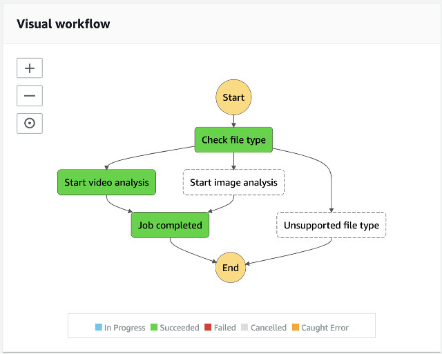

# Analysis State Machine

## Overview

The Analysis State Machine simply checks the type of the input file and starts the Video Analysis nested state machine or the Image Analysis (nested) state machine accordingly.

The diagram shows the training state machine.




See the implementation of the [Video Analysis state machine](../analysis-video/README.md) and the [Image Analysis state machine](../analysis-image/README.md).

___

## State Machine Execution Input

The input paramater to start a new analysis state machine is as follows:

```json
{
  "input": {
    "bucket": "<bucket-name>",
    "key": "path/video.mp4",
    "projectArn": "<project-arn>",
    "projectVersionArn": "<project-version-arn>",
    "inferenceUnits": 4
  }
}

```

where

| Parameter Name | Description |
| :--------------| :-----------|
| input.bucket | source bucket name |
| input.key | object key of the image or video file |
| input.projectArn | ARN of the Amazon Rekognition Custom Labels Project |
| input.projectVersionArn | ARN of the specific project version of the Amazon Rekognition Custom Labels model |
| input.inferenceUnits | numbers of inference endpoints to start the model |

__

## State: Check file type

A Choice state to switch among a video analysis nested state machine, an image analysis nested state machine, or unsupported file.

__

## State: Start video analysis

A Nested workflow to start video analysis.

### State Language

```json
{
    ...
    "Start video analysis": {
        "Type": "Task",
        "Resource": "arn:aws:states:::states:startExecution.sync",
        "Parameters": {
            "Input": {
                "input.$": "$.input",
                "output.$": "$.output"
            },
            "StateMachineArn": "<video-analysis-state-machine-arn>"
        },
        "Next": "Job completed"
    },
    ...
}
```

__

## State: Start image analysis

A Nested workflow to start image analysis.

### State Language

```json
{
    ...
    "Start image analysis": {
        "Type": "Task",
        "Resource": "arn:aws:states:::states:startExecution.sync",
        "Parameters": {
            "Input": {
                "input.$": "$.input",
                "output.$": "$.output"
            },
            "StateMachineArn": "<image-analysis-state-machine-arn>"
        },
        "Next": "Job completed"
    },
    ...
}
```
__

## State: Job completed

Job completed consolidates results from all states.

___

## Navigating the code structure

This state machine contains one lambda function [source/analysis/states/](./states)

| Name | Description |
|:-----|:------------|
| job-completed/ | Job completed state |


The state machine lambda function uses an AWS Lambda Layer, core-lib layer.

___

## Security

The Training state machine is govening by two IAM Roles: one for the state machine and one for the Job completed state lambda function.


### IAM Role of the State Machine
The State Machine is given permission to **invoke** a specific lambda function and to start and stop the nested state machines, Video Analysis and Image Analysis state machines.

```json
{
    "Version": "2012-10-17",
    "Statement": [
        {
            "Action": "lambda:InvokeFunction",
            "Resource": "arn:aws:lambda:<region>:<account>:function:ml9804-<stack-id>-*",
            "Effect": "Allow"
        },
        {
            "Action": "states:StartExecution",
            "Resource": [
                "arn:aws:states:<region>:<account>:stateMachine:ml9804-<stack-id>-analysis-image",
                "arn:aws:states:<region>:<account>:stateMachine:ml9804-<stack-id>-analysis-video"
            ],
            "Effect": "Allow"
        },
        {
            "Action": [
                "states:DescribeExecution",
                "states:StopExecution"
            ],
            "Resource": [
                "arn:aws:states:<region>:<account>:stateMachine:ml9804-<stack-id>-analysis-image",
                "arn:aws:states:<region>:<account>:stateMachine:ml9804-<stack-id>-analysis-video"
            ],
            "Effect": "Allow"
        },
        {
            "Action": [
                "events:PutTargets",
                "events:PutRule",
                "events:DescribeRule"
            ],
            "Resource": "arn:aws:events:<region>:<account>:rule/StepFunctionsGetEventsForStepFunctionsExecutionRule",
            "Effect": "Allow"
        }
    ]
}

```

__

### IAM Role of the State Lambda Functions

The state lambda function is given permission to write logs to Amazon CloudWatch Log Group.

```json
{
    "Version": "2012-10-17",
    "Statement": [
        {
            "Action": [
                "logs:CreateLogGroup",
                "logs:CreateLogStream",
                "logs:PutLogEvents"
            ],
            "Resource": "arn:aws:logs:<region>:<account>:log-group:/aws/lambda/*",
            "Effect": "Allow"
        }
    ]
}

```

___

Go to [Video Analysis State Machine](../analysis-video/README.md) | Go to [Image Analysis State Machine](../analysis-image/README.md) | Back to [Training State Machine](../gt-labeling/README.md) | Return to [README](../../README.md)

