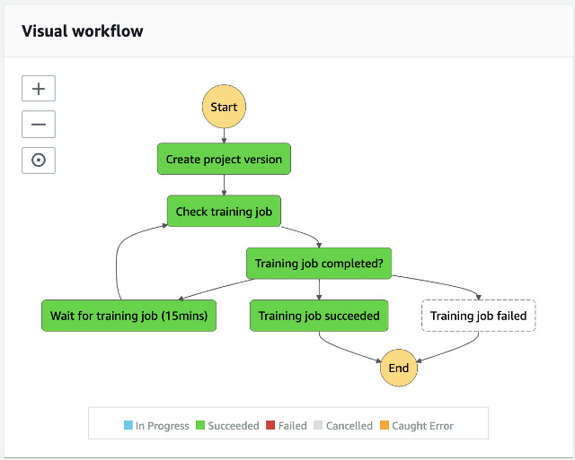
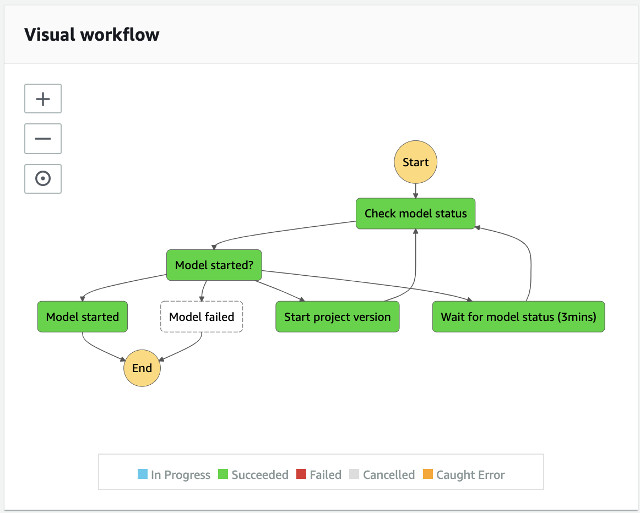

# Custom Labels Model Training State Machine

## Overview

The Custom Labels Model Training State Machine processes an image file. It first auto-starts the Amazon Rekognition Custom Labels model and then run detectCustomLabels APIs to analzye the image.


The diagram presents the custom labels model training state machine.



___

## State Machine Execution Input

The input paramater to start a new model training state machine is as follows:

```json
{
  "input": {
    "bucket": "<bucket-name>",
    "key": "<project-name>/collect-annotations/consolidatedAnnotations.json",
    "labelingJobName": "<unique-labeling-job-name>"
  }
}

```

where

| Parameter Name | Description |
| :--------------| :-----------|
| input.bucket | source bucket name |
| input.key | object key of the consolidated annotations JSON file |
| input.labelingJobName | an unique labeling job name to identify the Amazon Rekognition Custom Labels Project |

__

## State: Create project version

Create project version state first calls Rekognition.createProject API to create a project space. Then, calls Rekognition.createProjectVersion API to create a specific project version (model) with the consolidated annotations which contains the aritfacts (images, labels, and bouding boxes information).

__

## State: Check training job

Check training job state calls calls Rekognition.describeProjectVersions API to check the status of the training model.

__

## State: Training job completed?

A Choice state compares the model status by checking **$.output['check-training-job'].status**. If the status is **TRAINING_IN_PROGRESS**, it switches to Wait for training job (15 mins) state. If the status is **TRAINING_FAILED**, **DELETING**, or **FAILED**, it switches to Training job failed state. Otherwise, it moves to Training job succeeded state to indicate the training has completed.

__

## State: Wait for training job (15 mins)

A Wait state to wait 15 minutes.

__

## State: Training job succeeded

The Training job succeeded state is an End state to indicate the training job is completed.

__

## State: Training job failed

The Training job failed state is an End state to indicate the training job has failed.

___

## Navigating the code structure

This state machine contains one lambda function [source/custom-labels/states/](./states)

| Name | Description |
|:-----|:------------|
| create-project-version/ | Create project version state |
| check-training-job/ | Check training job state |


The state machine lambda function uses an AWS Lambda Layer, core-lib layer.

___

## Navigating State Machine Outputs on Amazon S3 Source Bucket

The state machine stores Custom Labels training dataset manifest to the Amazon S3 **source** bucket.

| Location | Description |
|:---------|:------------|
| s3://\<source-bucket\>/\<project-name\>/create-project-version/trainingDataset.manifest | the training dataset used to train an Amazon Rekognition Custom Labels model |


___


# Custom Labels Start Model State Machine

## Overview

The Custom Labels Start Model State Machine manages the runtime of the Amazon Rekognition Custom Labels model. It is a nested workflow used by [Video Analysis State Machine](../analysis-video/README.md) and [Image Analysis State Machine](../analysis-image/README.md).


The diagram presents the custom labels start model state machine.



___

## State Machine Execution Input

The input paramater to start an Amazon Rekognition Custom Labels model state machine is a pass through from Video Analysis State Machine or Image Analysis State Machine.

```json
{
  "output": {
    "extract-keyframes": {
      ...
    }
  },
  "input": {
    "bucket": "<bucket-name>",
    "key": "path/video01.mp4",
    "projectArn": "<project-arn>",
    "projectVersionArn": "project-version-arn",
    "inferenceUnits": 4
  }
}

```

where

| Parameter Name | Description |
| :--------------| :-----------|
| input.bucket | source bucket name |
| input.key | object key of the consolidated annotations JSON file |
| input.projectArn | ARN of the Amazon Rekognition Custom Labels Project |
| input.projectVersionArn | ARN of the specific project version of the Amazon Rekognition Custom Labels model |
| input.inferenceUnits | numbers of inference endpoints to start the model |
| output.* | previous state outputs pass through from Video Analysis State Machine or Image Analysis State Machine (not-used) |

__

## State: Check model status

Check model status state calls Rekognition.describeProjectVersions API to check the model status.

__

## State: Model started?

A Choice state compares **$.output['check-model-status'].status**. If the status is **RUNNING**, it switches to Model started state. If the status is **TRAINING_COMPLETED** or **STOPPING**, it switches to Start project version state. If the status is **TRAINING_FAILED**, **FAILED**, or **DELETING**, it switches to Model failed state. Otherwise, it goes to Wait for model status (3 mins) state to wait for the model to run.

__

## State: Model failed

An End state indicates the model fails to start.

__

## State: Wait for model status (3 mins)

A Wait state to pause the execution for 3 minutes and recheck the model status.

__

## State: Start project version

Start project version state calls Rekognition.startProjectVersion API to start the model.

__

## State: Model started

Model started state computes the required model runtime based on the numbers of frames to run prediction, the numbers of inference, and the model throughput and registers the model with a TimeToLive (TTL) attribute to an Amazon DynamoDB table, model-timer table. The TTL is used to run the auto spin down logic so you don't have a model idling for long period of time which imposes cost.

The technique used are [Amazon DynamoDB Time To Live (TTL)](https://docs.aws.amazon.com/amazondynamodb/latest/developerguide/TTL.html) and [Capturing Table Activity with DynamoDB Streams](https://docs.aws.amazon.com/amazondynamodb/latest/developerguide/Streams.html).  The TTL allows an item to be expired and removed from the table where the Amazon DynamoDB Stream allows us to act on any changes from the table. In our case, we only care about REMOVE event. Upon the REMOVE event, we then stop the running model. 

See the implementation of the [Model Timer Stream](../model-timer-stream/README.md).


___

## Security

The permission of the state machine and the state lambda functions are govened by two IAM Roles; one for the state machine and another for the state lambda function.


### IAM Role of the State Machine
The State Machine is given permission to **invoke** specific lambda functions.

```json
{
    "Version": "2012-10-17",
    "Statement": [
        {
            "Action": "lambda:InvokeFunction",
            "Resource": "arn:aws:lambda:<region>:<account>:function:ml9801-<guid>-*",
            "Effect": "Allow"
        }
    ]
}

```

__

### IAM Role of the State Lambda Functions
The state lambda function is given permission to access the **Amazon S3** source bucket, to run Amazon Rekognition Create and Describe Project Version API, and to update item on an **Amazon DynamoDB** table, model-timer table.

```json
{
    "Version": "2012-10-17",
    "Statement": [
        {
            "Action": [
                "logs:CreateLogGroup",
                "logs:CreateLogStream",
                "logs:PutLogEvents"
            ],
            "Resource": "arn:aws:logs:<region>:<account>:log-group:/aws/lambda/*",
            "Effect": "Allow"
        },
        {
            "Action": "s3:ListAllMyBuckets",
            "Resource": "arn:aws:s3:::*",
            "Effect": "Allow"
        },
        {
            "Action": "s3:ListBucket",
            "Resource": "arn:aws:s3:::<bucket-name>",
            "Effect": "Allow"
        },
        {
            "Action": [
                "s3:GetObject",
                "s3:GetObjectAcl",
                "s3:GetObjectVersion",
                "s3:GetObjectTagging",
                "s3:PutObject",
                "s3:PutObjectAcl"
            ],
            "Resource": "arn:aws:s3:::<bucket-name>/*",
            "Effect": "Allow"
        },
        {
            "Action": "rekognition:DescribeProjects",
            "Resource": "*",
            "Effect": "Allow"
        },
        {
            "Action": [
                "rekognition:CreateProject",
                "rekognition:DescribeProjectVersions"
            ],
            "Resource": "arn:aws:rekognition:<region>:<account>:project/*/*",
            "Effect": "Allow"
        },
        {
            "Action": "rekognition:CreateProjectVersion",
            "Resource": [
                "arn:aws:rekognition:<region>:<account>:project/*/*",
                "arn:aws:rekognition:<region>:<account>:project/*/version/*/*"
            ],
            "Effect": "Allow"
        },
        {
            "Action": [
                "rekognition:StartProjectVersion",
                "rekognition:StopProjectVersion"
            ],
            "Resource": "arn:aws:rekognition:<region>:<account>:project/*/version/*/*",
            "Effect": "Allow"
        },
        {
            "Action": [
                "dynamodb:DeleteItem",
                "dynamodb:DescribeTable",
                "dynamodb:Query",
                "dynamodb:Scan",
                "dynamodb:PutItem",
                "dynamodb:UpdateItem",
                "dynamodb:Attributes",
                "dynamodb:LeadingKeys",
                "dynamodb:ReturnConsumedCapacity",
                "dynamodb:ReturnValues",
                "dynamodb:Select"
            ],
            "Resource": "arn:aws:dynamodb:<region>:<account>:table/ml9804-<stack-id>-model-timer",
            "Effect": "Allow"
        }
    ]
}

```

___

Go to [Video Analysis State Machine](../analysis-video/README.md) | Go to [Image Analysis State Machine](../analysis-image/README.md) | Return to [README](../../README.md)

