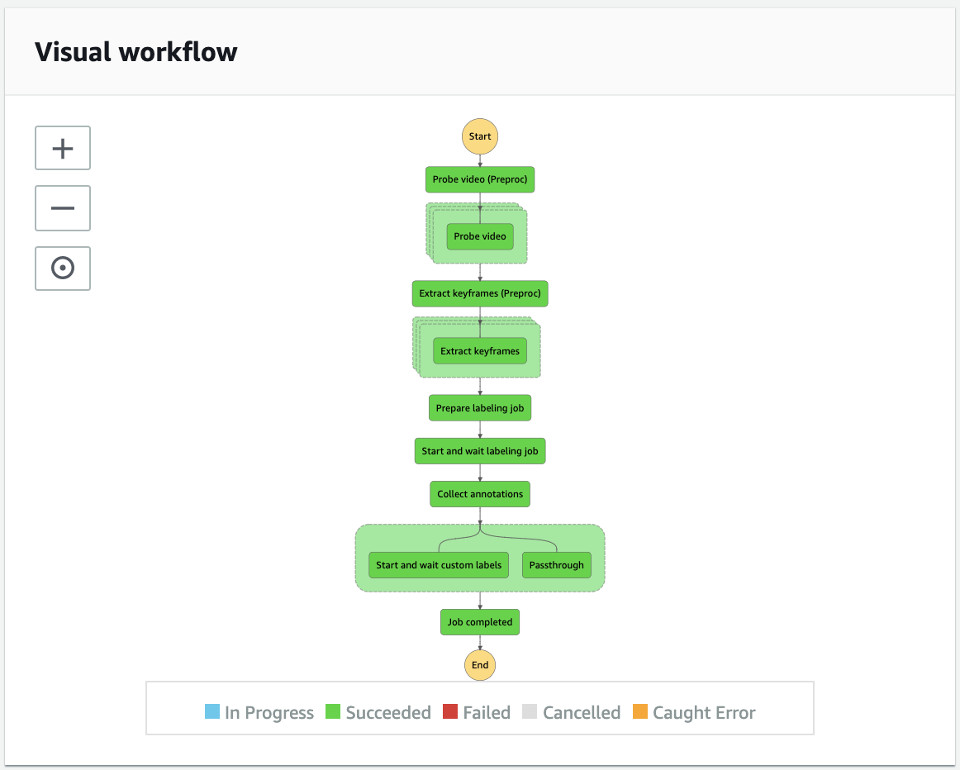
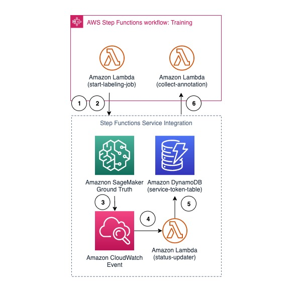

# Training State Machine

## Overview

The Training State Machine uses [AWS Step Functions](https://aws.amazon.com/step-functions/) to orchestrate the dataset preparation and model training workflow where it composes of numbers of states: probing video, extracting frames, starting and waiting for an Amazon SageMaker Ground Truth labeling job, collecting annotations, and creating and training an Amazon Rekognition Custom Labels model.

The diagram shows the training state machine.


___

## State Machine Execution Input
The input paramater to start a new training state machine is as follows:

```json
{
  "input": {
    "projectName": "my-project",
    "trainingType": "object", // or "concept"
    "bucket": "<bucket-name>",
    "keys": [
      "path/video01.mp4",
      "path/video02.mp4",
      "path/video03.mp4",
      "path/video04.mp4"
    ],
    "labels": [
      "Label 01",
      "Label 02"
    ]
  }
}

```

where

| Parameter Name | Description |
| :--------------| :-----------|
| input.projectName | projectName used to prefix the labeling job and project name of model |
| input.trainingType | **object** refers to object detection with bounding box. **concept** refers to image classification. |
| input.bucket | source bucket name |
| input.keys | a list of video files (or image files) to use for labeling and training a model |
| input.labels | a list of labels to use for annotation and training a model |

__

## State: Probe video (Preproc)

Probe video (Preproc) state prepares a list of iterations for the next state, Probe video to achieve the parallel processing using [AWS Step Functions Map](https://docs.aws.amazon.com/step-functions/latest/dg/amazon-states-language-map-state.html) feature. It allows us to optimize for speed by parallelly processing numbers of input video files.

__

## State: Probe video

Probe video state is a Map state that runs all iterations in parallel. Each iterator takes an input parameters of bucket, key (a video file), and projectName and run ffprobe to extract all the frame information of the given video file. The output of each iterator stores the frames information in JSON format and uploads to Amazon S3 bucket.

Here is an input example of each iterator of this Map state:

```json
{
  "projectName": "project-name",
  "bucket": "<bucket-name>",
  "key": "path/video001.mp4",
}

```
where 

| Parameter Name | Description |
| :--------------| :-----------|
| projectName | projectName used to prefix the labeling job and project name of model |
| bucket | source bucket name |
| key | the specific video file to work on |

__

## State: Extract keyframes (Preproc)

Similar to Probe video (Preproc) state, Extract keyframes (Preproc) state prepares a list of iterations for the Extract keyframe Map state by slicing all frames from all video files into numbers of iterators for parellel processing.

__

## State: Extract keyframes

Extract keyframes state is a Map state where each iterator is given an input specifying the video file, the location of the frame information, numbers of frames to extract from the video, and the start location of the video to extract frames.

Here is an input example of each iterator of this Map state:

```json
{
  "projectName": "project-name",
  "bucket": "<bucket-name>",
  "key": "path/video001.mp4",
  "keyframesJson": "path/video001/keyframes.json",
  "totalFrames": 3000,
  "startIndex": 1200,
  "framesPerSlice": 600
}

```
where 

| Parameter Name | Description |
| :--------------| :-----------|
| projectName | projectName used to prefix the labeling job and project name of model |
| bucket | source bucket name |
| key | the specific video file to work on |
| keyframesJson | the frame information extracted from Probe video state |
| totalFrames | numbers of frames in the video |
| startIndex | frame index of this Map iterator should start the frame extraction |
| framesPerSlice | numbers of frames this Map iterator should extract |

__

## State: Prepare labeling job

Prepare labeling job state takes the extracted frames and prepares the necessary information such as frame sequence files, a dataset manifest, and task template in order to start an Amazon SageMaker Ground Truth labeling job. This demo solution supports two types of labeling job: [Video Object Detection](https://docs.aws.amazon.com/sagemaker/latest/dg/sms-video-object-detection.html) and [Image Classification](https://docs.aws.amazon.com/sagemaker/latest/dg/sms-image-classification.html) depending on the **trainingType** you specify in the state machine execution input parameter.

__

## State: Start and wait labeling job

Start and wait labeling job state starts an Amazon SageMaker Ground Truth labeling job and wait for it to complete. It is important to note no resource is used during the wait time.

This state uses [AWS Step Functions Service Integration Technique](https://docs.aws.amazon.com/step-functions/latest/dg/concepts-service-integrations.html) and [Amazon CloudWatch Events of Ground Truth Labeling Job Status](https://docs.aws.amazon.com/sagemaker/latest/dg/sms-monitor-cloud-watch.html).

The diagram illustrates how this works.



Step (1): the lambda function registers a state machine execution token to an Amazon DynamoDB table. The token assigned by Amazon Step Functions is used to send a task result back to the state machine execution in interest.

Step (2): the lambda function starts a new labeling job by calling sagemaker.createLabelingJob APIs and exits. At this point, the state is paused until it receives a task notification with the token. The lambda function is terminated and consumes no resource.

Step (3): Amazon SageMaker Ground Truth sends SageMaker Ground Truth Labeling Job State Change to Amazon CloudWatch Events.

Step (4): A status updater lambda function is called when the LabelingJobStatus is Completed. See the implementation of the [status updater lambda function](../status-updater/README.md)

Step (5): the same lambda fetches the execution token from an Amazon DynamoDB table and sends the task result back to the state machine execution

Step (6): Upon receiving the task result, the execution continues and switches to the next state, Collect annotation states.

### State Language

```json
{
    ...
    "Start and wait labeling job": {
      "Type": "Task",
      "Resource":"arn:aws:states:::lambda:invoke.waitForTaskToken",
      "Parameters": {
          "FunctionName": "<lambda-function-name>",
          "Payload": {
              "token.$":"$$.Task.Token",
              "state": "start-labeling-job",
              "input.$": "$.input",
              "output.$": "$.output"
          }
      },
      "TimeoutSeconds": 345600,
      "Next": "Collect annotations"
  },
  ...
}
```

where

**arn:aws:states:::lambda:invoke.waitForTaskToken** indicates that this state will wait for a task result from an external process.

**$$.Task.Token** is the token to identify this state machine execution.

__

## State: Collect annotations

Collect annotations state consolidates annotations from the labeled job and converts the results into a training dataset manifest file getting ready to train an Amazon Rekognition Custom Labels model. See more details of [Object Localization in Manifest Files](https://docs.aws.amazon.com/rekognition/latest/customlabels-dg/cd-manifest-files-object-detection.html) and [Image-Level Labels in Manifest Files](https://docs.aws.amazon.com/rekognition/latest/customlabels-dg/cd-manifest-files-classification.html)

__

## State: Start and wait custom labels

Start and wait custom labels state create a new training job using Amazon Rekognition Custom Labels. This state uses another technique, [AWS Step Functions Nested Workflows](https://docs.aws.amazon.com/step-functions/latest/dg/concepts-nested-workflows.html). This allows us to keep the state machine simple and readable.

See details implementation of the [Custom Labels Model Training State Machine](../custom-labels/README.md#custom-labels-model-training-state-machine)


### State language
To start a nested workflow,

```json
{
    ...
    "Start and wait custom labels": {
        "Type": "Task",
        "Resource": "arn:aws:states:::states:startExecution.sync",
        "Parameters": {
            "Input": {
                "input.$": "$.output['collect-annotations'].output"
            },
            "StateMachineArn": "<custom-labels-model-training-state-machine-arn>"
        },
        "End": true
    }
    ...
}

```
where

**arn:aws:states:::states:startExecution.sync** instructs the current execution to start and wait for the nested workflow.

__

## State: Passthrough

This is simply a "Pass" state to carry over the state parameter.

__

## State: Job completed

Job completed consolidates results from all states.

___

## Navigating the code structure

The code is structured by its state names under [source/gt-labeling/states/](./states)

| Name | Description |
|:-----|:------------|
| probe-video-preproc/ | Probe video (Preproc) state |
| probe-video/ | Probe video Map state |
| extract-keyframes-preproc/ | Extract keyframes (Preproc) state |
| extract-keyframes/ | Extract keyframes Map state |
| prepare-labeling-job/ | Prepare labeling job state |
| start-labeling-job/ | Start labeling job state |
| collect-annotations/ | Collect annotations state |
| job-completed/ | Job completed state |
| shared/ | shared components for this state machine |


The state machine lambda function also uses numbers of AWS Lambda Layers, (1) core-lib which contains common utility classes shared across other components of the solution, (2) FFmpeg layer which helps to probe video and extract frames, (3) Jimp layer to resize and create sprite images, and (4) Latest AWS SDK layer.

___

## Navigating State Machine Outputs on Amazon S3 Source Bucket

The state machine stores various state outputs to the Amazon S3 **source** bucket organized by its state names.

| Location | Description |
|:---------|:------------|
| s3://\<source-bucket\>/\<project-name\>/extract-keyframes/\<video-basename\>/keyframes.json | keyframes.json contains the frame information of the video file |
| s3://\<source-bucket\>/\<project-name\>/extract-keyframes/\<video-basename\>/*.jpg | contains all extracted frames from the video. Naming convention is \<frame-name\>.jpg |
| s3://\<source-bucket\>/\<project-name\>/prepare-labeling-job/\<video-basename\>/frameSequence-\<index\>.json | frameSequence-1.json contains the location of the frames and sequence of frames (upto 2,000 frame) of the corresponding video file. It is used by Amazon SageMaker Ground Truth to locate the frames in a labeling job |
| s3://\<source-bucket\>/\<project-name\>/prepare-labeling-job/dataset.manifest | a manifest file specifies a list of source reference (the frameSequence JSON files) |
| s3://\<source-bucket\>/\<project-name\>/prepare-labeling-job/labelCategoryConfig.json | a configuration file contains a list of labels and instruction to be used for the labeling job |
| s3://\<source-bucket\>/\<project-name\>/start-labeling-job/ | stores outputs from Amazon SageMaker Ground Truth Labeling job |
| s3://\<source-bucket\>/\<project-name\>/collect-annotations/consolidatedAnnotations.json | consolidated annotation results from the labeling job |


___

## Security

The Training state machine is govening by three IAM Roles: one for the state machine, one for the state lambda function, and one for the labeling team to access the labeling job web portal.


### IAM Role of the State Machine
The State Machine is given permission to **invoke** specific lambda functions and to start and stop a nested state machine, [Custom Labels Training state machine](../custom-labels/README.md#custom-labels-model-training-state-machine).


```json
{
    "Version": "2012-10-17",
    "Statement": [
        {
            "Action": "lambda:InvokeFunction",
            "Resource": "arn:aws:lambda:<region>:<account>:function:ml9804-<stack-id>-*",
            "Effect": "Allow"
        },
        {
            "Action": "states:StartExecution",
            "Resource": "arn:aws:states:<region>:<account>:stateMachine:ml9804-<stack-id>-custom-labels-training-job",
            "Effect": "Allow"
        },
        {
            "Action": [
                "states:DescribeExecution",
                "states:StopExecution"
            ],
            "Resource": "arn:aws:states:<region>:<account>:stateMachine:ml9804-<stack-id>-custom-labels-training-job",
            "Effect": "Allow"
        },
        {
            "Action": [
                "events:PutTargets",
                "events:PutRule",
                "events:DescribeRule"
            ],
            "Resource": "arn:aws:events:<region>:<account>:rule/StepFunctionsGetEventsForStepFunctionsExecutionRule",
            "Effect": "Allow"
        }
    ]
}

```

__

### IAM Role of the State Lambda Functions

The state lambda function is given permission to access the **Amazon S3** source bucket, to create an **Amazon SageMaker Ground Truth** Labeling Job, and to store execution token to an **Amazon DynamoDB** table, service-token table.

```json
{
    "Version": "2012-10-17",
    "Statement": [
        {
            "Action": "s3:ListBucket",
            "Resource": "arn:aws:s3:::<bucket-name>",
            "Effect": "Allow"
        },
        {
            "Action": [
                "s3:GetObject",
                "s3:PutObject",
                "s3:SelectObjectContent"
            ],
            "Resource": "arn:aws:s3:::<bucket-name>/*",
            "Effect": "Allow"
        },
        {
            "Action": [
                "logs:CreateLogGroup",
                "logs:CreateLogStream",
                "logs:PutLogEvents"
            ],
            "Resource": "arn:aws:logs:<region>:<account>:log-group:/aws/lambda/*",
            "Effect": "Allow"
        },
        {
            "Action": "sagemaker:DescribeLabelingJob",
            "Resource": "arn:aws:sagemaker:<region>:<account>:labeling-job/*",
            "Effect": "Allow"
        },
        {
            "Condition": {
                "StringEquals": {
                    "sagemaker:WorkteamArn": "arn:aws:sagemaker:<region>:<account>:workteam/private-crowd/ml9804-<stack-id>-team"
                }
            },
            "Action": "sagemaker:CreateLabelingJob",
            "Resource": "arn:aws:sagemaker:<region>:<account>:labeling-job/*",
            "Effect": "Allow"
        },
        {
            "Action": "iam:PassRole",
            "Resource": "arn:aws:iam::<account>:role/<labeler-role>",
            "Effect": "Allow"
        },
        {
            "Action": [
                "dynamodb:DeleteItem",
                "dynamodb:DescribeTable",
                "dynamodb:Query",
                "dynamodb:Scan",
                "dynamodb:UpdateItem",
                "dynamodb:Attributes",
                "dynamodb:LeadingKeys",
                "dynamodb:ReturnConsumedCapacity",
                "dynamodb:ReturnValues",
                "dynamodb:Select"
            ],
            "Resource": "arn:aws:dynamodb:<region>:<account>:table/ml9804-<stack-id>-service-token",
            "Effect": "Allow"
        }
    ]
}

```

__

### IAM Role for the Labeling Team

The labeler is given permission to get and put object to the **Amazon S3** source bucket through the labeling job web portal which is authenticated with **Amazon Cognito User Pool**.

```json
{
    "Version": "2012-10-17",
    "Statement": [
        {
            "Condition": {
                "StringEquals": {
                    "iam:PassedToService": "sagemaker.amazonaws.com"
                }
            },
            "Action": "iam:PassRole",
            "Resource": "*",
            "Effect": "Allow"
        },
        {
            "Action": [
                "s3:GetBucketLocation",
                "s3:ListBucket"
            ],
            "Resource": "arn:aws:s3:::<bucket-name>",
            "Effect": "Allow"
        },
        {
            "Action": [
                "s3:GetObject",
                "s3:PutObject"
            ],
            "Resource": "arn:aws:s3:::<bucket-name>/*",
            "Effect": "Allow"
        },
        {
            "Action": [
                "logs:CreateLogGroup",
                "logs:CreateLogStream",
                "logs:DescribeLogStreams",
                "logs:PutLogEvents"
            ],
            "Resource": "arn:aws:logs:<region>:<account>:log-group:*",
            "Effect": "Allow"
        },
        {
            "Action": "cloudwatch:PutMetricData",
            "Resource": "*",
            "Effect": "Allow"
        }
    ]
}
```

___

Next to [Analysis State Machine](../analysis/README.md) | Back to [RESTful API Component](../api/README.md) | Return to [README](../../README.md)

